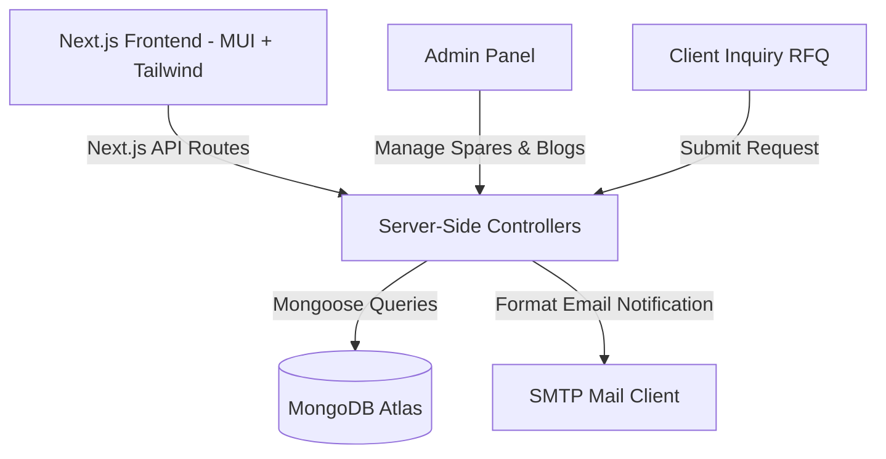

# ⚓ Aarfa Marine — B2B Maritime Equipment & Services Portal

[](https://aarfamarine.com)
[](https://github.com/Alfaz-17/aarfamarine)
[](https://nextjs.org)
[](https://mui.com)
[](https://tailwindcss.com)
[](https://www.mongodb.com)

Aarfa Marine is a professional, full-featured marine products and services B2B web application. Engineered using Next.js and Material UI, this platform serves as an interactive portal for marine engineering departments and shipping companies to browse catalog components and request quotes for drydock and repair services.

---

## 🌟 Architectural Features & Design Patterns

### 1. 🛒 Hierarchical Product Catalog & Filtering
* **Dynamic Search & Browsing**: Clients can search and filter marine spare parts by category, brand, and machinery compatibility (e.g., *auxiliary engines, pumps, electrical spares*).
* **Detailed Product Sheets**: Custom-designed landing components containing full technical drawings, dimensions, and structural specifications.

### 2. 🛠️ Comprehensive Services & RFQ System
* **Services Directory**: Displays specialized shipyard services, marine automation repairs, main-engine overhauls, and hydraulic systems maintenance.
* **Direct Inquiry Channels**: Features structured B2B contact forms mapped directly to specific products and services, automatically routing customer requests to the sales inbox.

### 3. 🔐 Secured Admin Panel & Content Management (CMS)
* **CRUD Management**: Backed by secure session filters, admins can perform full CRUD operations on categories, individual product specs, news blogs, and service descriptions.
* **Database Client**: Utilizes Mongoose to coordinate read/write transactions, maintaining referential sanity across collections when categories are added or modified.

### 4. 💫 Seamless Animations & Hybrid Rendering
* **Material UI & Tailwind**: Integrates a hybrid CSS approach, blending Material UI's design layouts with Tailwind's utility-first styling for maximum interface responsive fidelity.
* **Framer Motion**: Powering visual entry states, gallery sliders, and smooth route transitions to create a premium client experience.

---

## 🏗️ System Architecture



---

## 📂 Codebase Directory Structure

```bash
Aarfa-marine/
├── public/               # Static assets, logos, component photos
├── src/
│   ├── components/       # Reusable UI modules (Header, Footer, ProductCard)
│   ├── pages/            # Next.js Page Router layouts
│   │   ├── admin/        # CMS dashboard (requires authentication)
│   │   ├── api/          # Serverless API routes (auth, products, contact)
│   │   ├── products/     # Dynamic product detail sheets
│   │   ├── services/     # Shipbuilding & machinery overhaul directories
│   │   ├── blog/         # Marine industry maintenance news
│   │   └── _app.tsx      # Main wrapper & Theme config
│   ├── styles/           # Global styles and custom CSS
│   └── utils/            # Helper scripts (DB connection, formatting)
├── next.config.js        # Next.js configurations
├── tsconfig.json         # TypeScript configuration
└── README.md
```

---

## 📊 Database Schema Design (Mongoose)

### **Product Schema**
```javascript
{
  name: { type: String, required: true, index: true },
  sku: { type: String, unique: true },
  description: { type: String, required: true },
  category: { type: Schema.Types.ObjectId, ref: 'Category', required: true },
  images: [{ type: String }],
  specifications: {
    weight: { type: String },
    model: { type: String },
    pressureRating: { type: String },
    certification: { type: String }
  },
  createdAt: { type: Date, default: Date.now }
}
```

### **Service Schema**
```javascript
{
  title: { type: String, required: true },
  description: { type: String, required: true },
  imageUrl: { type: String },
  pricingEstimate: { type: String },
  leadTime: { type: String }
}
```

---

## 📡 API Reference

### Catalog & Product APIs
* **`GET /api/products`**: Fetch categorized products with query parameters (`category`, `search`).
* **`GET /api/products/:id`**: Fetch detailed technical specs of a single item.

### Admin Content APIs
* **`POST /api/admin/products`**: Inserts a new catalog item (Requires JWT verification).
* **`PUT /api/admin/products/:id`**: Modifies an existing catalog item (Requires JWT verification).
* **`DELETE /api/admin/products/:id`**: Removes an item from the catalog (Requires JWT).

### Contact & RFQ API
* **`POST /api/contact/inquiry`**: Collects the client's information and product details, writing a record to MongoDB and mailing a notification to support staff.

---

## ⚙️ Installation & Setup

### 1. Prerequisites
* Node.js (v16+)
* MongoDB (Local instance or Atlas cloud cluster)

### 2. Configure Environment Variables
Create a `.env` file in the root directory:
```env
MONGODB_URI="mongodb+srv://<username>:<password>@cluster.mongodb.net/aarfamarine"
JWT_SECRET="your-jwt-signing-secret"
NEXTAUTH_SECRET="your-session-encryption-secret"
```

### 3. Run Locally
```bash
# Install package dependencies
npm install

# Run development server
npm run dev
```
Open [http://localhost:3000](http://localhost:3000) in your browser.
